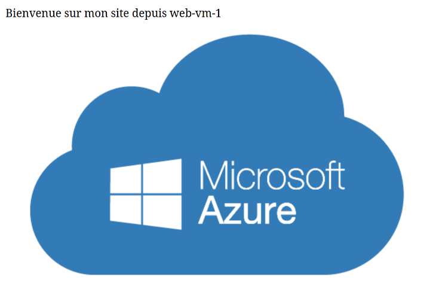

ECL09 - KEVIN DARDENNE
------------------------

Cette infrastructure déploie :

    Un Virtual Network (VNet) avec plusieurs subnets :
        Un subnet pour les VMs (machines Linux).
        Un subnet pour Azure Bastion (accès SSH/RDP sécurisé).
        Un subnet dédié à l’Application Gateway (niveau 7).

    Un NSG (Network Security Group) pour sécuriser l’accès aux VMs (HTTP depuis l’App Gateway, SSH depuis Bastion, etc.).

    Un Bastion Azure pour se connecter aux VMs sans exposer le port 22 sur Internet.

    Une Application Gateway (SKU Standard_v2) pour router le trafic HTTP (port 80) depuis une IP publique vers les VMs.

    Trois Machines Virtuelles (Ubuntu) qui hébergent une page web (via Nginx). Elles sont déployées derrière l’App Gateway.

    Un Storage Account (ou plusieurs, selon le nombre de subnets) pour stocker des images.
        Le container est en accès privé, et un SAS est généré pour accéder aux blobs.
        Les VMs utilisent un script cloud-init pour afficher l’image stockée (via l’URL SAS).

 

Principaux composants :

    Virtual Network
        CIDR : 172.18.0.0/16
        Trois subnets :
            subnet1 (172.18.1.0/24) pour les VMs
            AzureBastionSubnet pour Bastion
            subnet-appgw (172.18.10.0/24) pour l’App Gateway

    Network Security Group (NSG)
        Règles Inbound :
            Autoriser HTTP (port 80) depuis le subnet de l’AG
            Autoriser SSH (port 22) depuis le subnet Bastion
            Bloquer tout le reste

    Azure Bastion
        Permet de se connecter aux VMs (SSH/RDP) via le portail Azure, sans ouvrir de ports.
        Dispose de sa propre IP publique (SKU Standard).

    Application Gateway
        SKU Standard_v2 (gère la résilience, autoscaling, zones).
        IP publique Standard.
        Port 80 (HTTP).
        Routage vers les IP privées des VMs (Backend Pool).

    Machines Virtuelles
        3 VMs Ubuntu (ex: Canonical:UbuntuServer:22_04-lts:latest).
        Cloud-init pour installer Nginx et afficher une page d’accueil avec une image (provenant du Storage Account).

    Storage Account(s)
        Un ou plusieurs comptes de stockage, selon le nombre de subnets.
        Container “images” privé.
        Blobs uploadés automatiquement via Terraform.
        Data source azurerm_storage_account_sas pour générer un SAS en lecture/liste.
        Les VMs récupèrent l’URL signée (SAS) pour afficher l’image.

